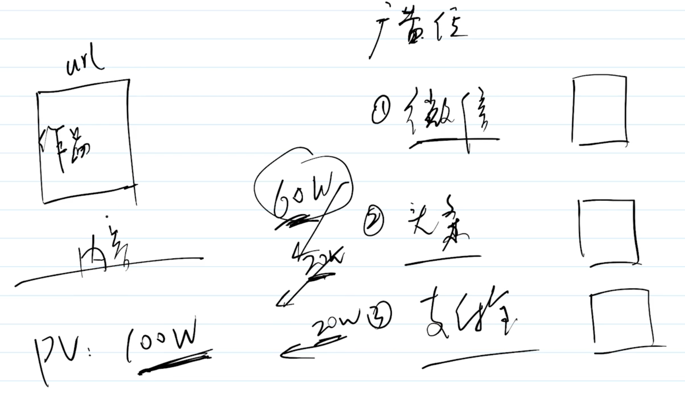
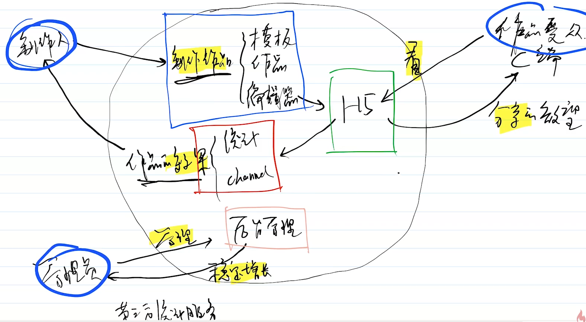
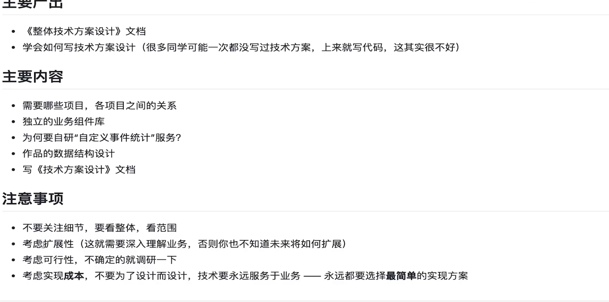

# 02-需求设计

> 脱离业务的架构就是刷流氓。架构师必须要深入理解需求、参与需求、看透需求背后的业务本质。

## 主要产出

- 熟悉产品需求
- 学会以架构师的思维分析需求
- 全局思维、整体思维、闭环思维

## 主要内容

- 如何以架构师思维分析需求
- 项目的浅层需求
- 项目的深度需求
- 需求总览

产品研发流程：画图

## 需求

浅层需求和深层需求

从输入到输出，形成闭环。
你的输入，输出给各个角色的结果是什么？

- 管理
	- 复制
	- 转移给他人
	- 删除后恢复
- 统计
	- 作品统计
	- 分渠道统计
- 发布
- 分享
- 后台管理
	- 数据统计
	- 作品管理：上线下线、防止违规内容
	- 用户管理：快速冻结、防止违规用户
	- 模版管理，能控制展示那些模块

架构师职责：用技术手段促进业务增长。

## 需要哪些项目

先不看细节，看整体，这一步就是确定项目的范围。确定范围是做任何事情的第一步。

范围确定好了，剩下的事情，即便有问题，也是内部问题。

### 需要哪些项目

- b端和编辑器 (biz是business 简写)
	- biz-editor-fe
	- biz-editor-serve
- h5 适合 SSR，因为考虑性能
	- h5-server
- 管理后台
	- admin-fe
	- admin-server
- 公用一个数据库

后台，b端都不需要做 SSR，要考虑成本。

前端编辑画布和 h5 是完全一样的，所以独立出一个公共组件库。