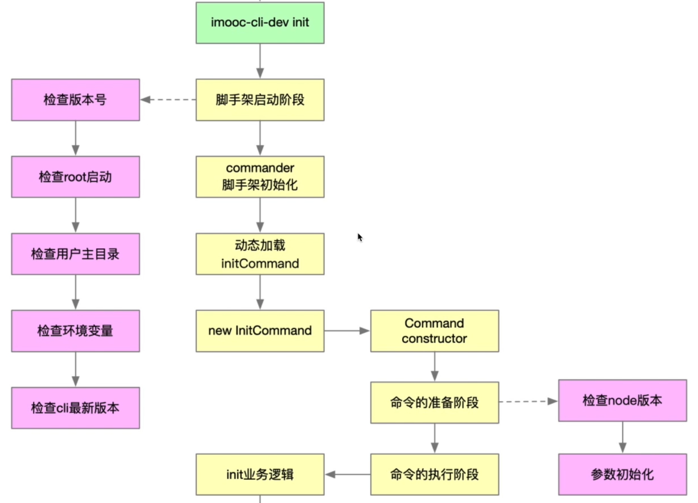
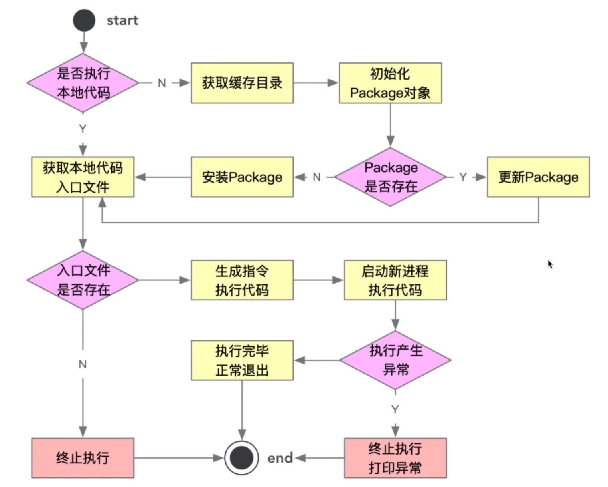

# 脚手架命令注册和执行过程开发

## 当前脚手架架构痛点

init 是动态的，每个团队的 init 是自己开发的。需要去动态加载各个团队的 init 包进行执行。如

- A 团队是 @a/init
- B 团队是 @b/init





## 增加 targetPath

1. 增加 option 参数

```js
.option('-tp, --targetPath <targetPath>', '是否指定本地调试文件路径', '')
```

2. 监听 targetPath

```js
program.on("option:targetPath", () => {
  const tp = program.getOptionValue("targetPath");
  if (tp) {
    progress.env.CLI_TARGET_PATH = tp;
  }
});
```

3. 在 `@v-cli/init` 中打印 process.env.CLI_TARGET_PATH, 可以得到值。

## 创建 @v-cli/exec 包

```
lerna create exec core
```

## 创建 @v-cli/package 包

```
lerna create package models
```


## 4-3 创建 npm 模块通用类 Package

Package 类的作用是根据参数，生成一个 npm 模块的信息。可以调用方法对模块进行安装，升级等操作。

在 models 下新建 Package 类。然后在 exec 中进行调用。
## 4-4 Package 类的属性、方法定义及构造函数逻辑开发

初始化 Package 类的属性和方法

- targetPath
- storePath
- packageName
- packageVersion
- exists()
- install()
- update()
- getRootFilePath()

在 exec 中实例化 Package。
