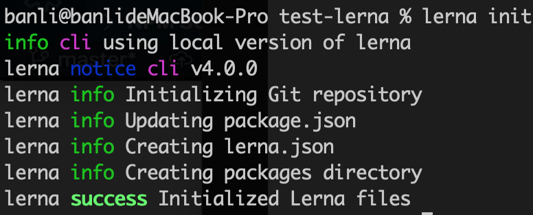
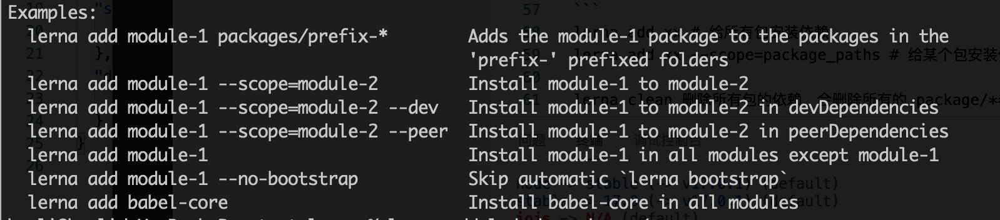
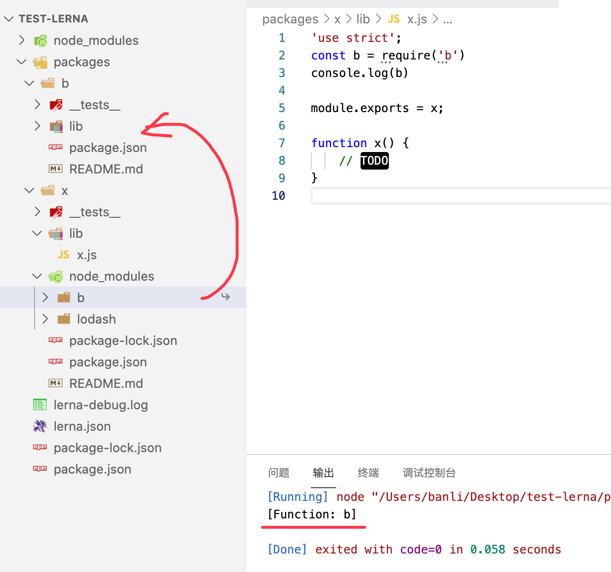

# lerna

## what

lerna 是一个基于 git + npm 的多 package 项目的管理工具

## why

原生脚手架开发痛点

- 重复操作
  - 多 package 管理
    - link
    - 安装
    - 测试
    - 代码提交
    - 发布
- 版本一致性
  - 发布时版本一致性
  - 发布后相互依赖版本升级

优势：

- 大幅减少重复操作
- 提升操作的标准化

lerna 是架构优化的产物，项目复杂度提升后，就需要对项目进行架构优化。架构优化的主要目标就是效能。

## how

### 脚手架项目初始化

1. 创建项目目录。
2. 执行 `npm init -y` 初始化 package.json。
3. 安装 lerna: `npm i lerna -D`。
4. 初始化项目：`lerna init`。这一步会自动初始化 git 、创建 packages 目录、创建 `lerna.json`文件。



### 创建 package

- lerna create 创建 package

- lerna add 安装依赖



- lerna link 链接依赖, 需要在 package.json 里添加依赖的包。会在包的 node_modules 目录下创建一个依赖包的快捷方式。



### 脚手架开发和测试

- lerna exec 执行 shell 脚本
- lerna run 执行 npm 命令，会执行 root 的 npm 脚本。
- lerna clean 清空依赖，会提示删除 packages 下面包的 node_modules 目录。
- lerna bootstrap 重装每个包的依赖

### 脚手架发布和上线

- lerna version 升级版本号，需要首先进行 git commit 
- lerna changed 查看修改过的包
- lerna diff 查看变更，从上次 commit 后的变更。
- lerna publish 会发布变更后的包，即 changed 了的包。

- [图解lerna publish](https://zhuanlan.zhihu.com/p/372889162)

```
lerna add xx # 给所有包安装依赖
lerna add xx --scope=package_paths # 给某个包安装依赖

lerna clean 删除所有包的依赖，会删除所有的 package/**/node_modules

lerna link 给依赖添加软链接，先在 package.json 里添加依赖

# 在每个 package 下 执行 shell 脚本
lerna exec `rm -rf ./node_modules`
lerna exec --scope package_name

# 执行每个 package 下的 npm 脚本
lerna run
lerna run --scope package_name
```

dedent 可以删除每行前后的缩进, 每行删除的长度一样

nvm 安装 node 太慢,更换淘宝镜像源
https://blog.urcloud.co/archives/105
