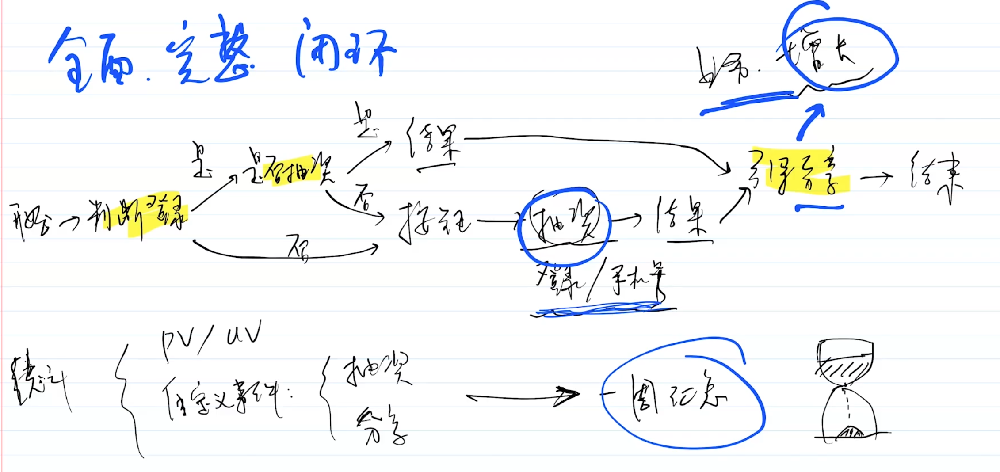

# 整体需求和架构分析

**规范的产品研发流程**

- 熟悉产品需求
- 学会以架构师的思维分析需求、理解需求
- 《整体技术方案设计》文档

## 熟悉产品需求

拿到一个需求后，需要了解：

- 需求的背景
- 需要做什么
- 想要的结果
- 产生的价值

## 以架构师的思维分析和理解需求

**什么是架构师思维**

- 整体全局思维: 整体流程全面，要看到背后的事情。
- 闭环思维： 要什么结果？

### 举例: 抽奖活动设计

你作为前端负责人，来开发一个 h5 页，某个抽奖功能的活动运营。你会要求 server 端提供哪些接口和能力？

- PM
- RD: 后端

**分析**

接口是根据详细的业务流程来定的。

业务流程：

- 登录
- 展示奖品、活动详情
- 点击抽奖
- 提示抽奖成功、失败
- 成功：填写手机号、地址？然后发放
- 分享: 理解业务、对业务增长负责
- 运营需要数据
  - uv、pv
  - 自定义事件：点击率、停留时常
  - 活动访客来源，可能投入广告，链接加参数，分渠道统计

**接口**

功能：

- 活动详情、奖品
- 抽奖接口: 抽奖、是否已抽过奖
- 登录？是否已抽过奖
- 查看中奖
- 如何发放奖品？填写个人电话、地址？

运营统计

- 埋点：pv、uv、按钮点击、分享？、停留时长
- 分渠道统计、转换率？

**总结**

要从架构师思维去看问题和需求。

架构师思维是什么: 整体、全局、闭环

架构师职责： 用技术手段提高业务增长。

## 写《整体技术方案设计》文档

## 学习方法

- 要有耐心，不要一心想着写代码，觉得需求和设计不重要
- 抛开你固有的程序员思维，开始准备接收架构师思维
- 要坚信：技术永远都是为业务服务的，技术是实现业务增长的工具

## 注意事项

- 不要关注细节，要看整体，看范围
- 设计时判断可行性，不确定的就要调研一下（这需要大量的工作经验积累，技术能力）
- 设计要考虑复杂度，越简单越好，不要过渡设计，不要为了设计而设计
