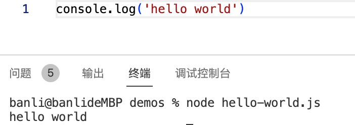
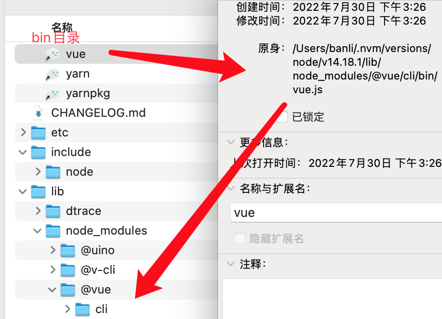
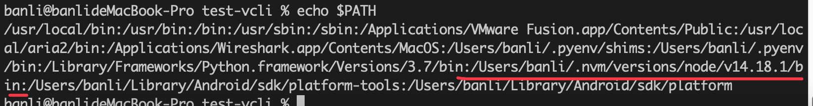
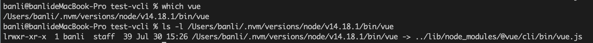
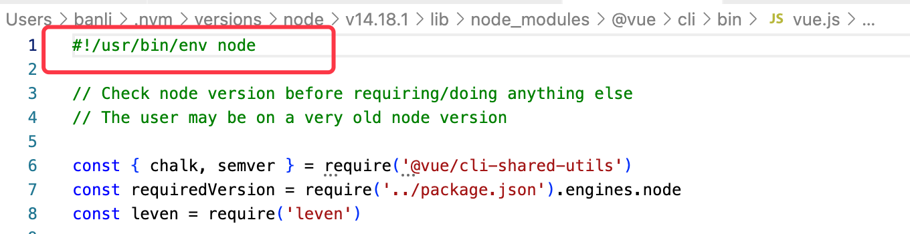

# 前端脚手架介绍

## 简介

前端脚手架本质上就是一个电脑上可执行的软件，通过命令行执行。更准确的说，它是通过 node 来执行我们编写的 js 脚本。

比如新建一个 `hello-world.js`，然后就可以通过 `node hello-world.js` 来执行这个脚本。



下面以 `@vue/cli` 来说明脚手架的执行原理。

`@vue/cli` 是平时工作中常用的脚手架，当 `npm i -g @vue/cli` 后，我们就可以运行 vue 命令创建项目了。

```sh
vue create test
```

那么为什么可以执行 vue 命令呢？先来看看 `npm i -g @vue/cli` 都做了什么。

## npm i -g 做了什么

在执行 `npm i -g @vue/cli` 时, 做了如下事情:

- 在全局 `node路径/lib/node_modules` 里安装 `@vue/cli` 包
- 根据包里 `package.json` 的 bin 配置字段，在 `node路径/bin` 目录下创建一个名为 vue 的软链接(相当于快捷方式)。



注意：如果执行命令的目录下包含 `@vue/cli` 项目，执行 `npm i -g` 时会在全局 node_modules 下创建该目录的一个软链接指向当前目录，如果不想这样，就离开该目录进行全局安装。

## 执行 vue 命令做了什么

在执行 vue 命令时，大致流程如下:

1. 终端会在环境变量 $PATH 中找 vue 命令，然后找到真实的 `vue.js` 文件。




2. vue.js 第一行内容是 `#!/usr/bin/env node`, 它告诉系统在执行文件时, 到环境变量 env 里去寻找 node 命令，然后执行，即 `node vue.js`。



注意: 不能写成本机 node 程序地址, 如`#!/usr/bin/node`，这样在其他人电脑上可能就不存在。

3. 执行完脚本后，退出。

## 命令的组成

知道了命令 vue 的执行过程，下面介绍一个命令的组成部分：

```sh
vue create test --force --no-git
```

一个可执行命令语句主要分为四个部分:

- 主命令, 即 `vue`
- 子命令, 如 `create`
- param 参数, 如 `test`
- option 选项: 如选项名 `--force`(强制覆盖目录)， 它的值为 true

> 选项可以分为长选项和短选项，短选项相当于是别名, 比如 `--force` 的短选项为 `-f`，`--no-git` 的短选项为 `-n`。短选项可以合并使用，如 `-fn`。


## 附

1. 在 mac 上可以通过 ln -s 创建软链接

<<<<<<< HEAD
```
ln -s xx/vue.js /usr/bin/vue
```
=======
如果报错可以直接删除 node_modules 下的 test-v-lib。


windows 下是会编译出三个文件

vue
vue.cmd
vue.ps1 powershell

会去执行 C:\Users\Admin\AppData\Roaming\npm 下的 node_modules\@vue\cli\bin\vue.js

```
# vue.cmd
@ECHO off
SETLOCAL
CALL :find_dp0

IF EXIST "%dp0%\node.exe" (
  SET "_prog=%dp0%\node.exe"
) ELSE (
  SET "_prog=node"
  SET PATHEXT=%PATHEXT:;.JS;=;%
)

"%_prog%"  "%dp0%\node_modules\@vue\cli\bin\vue.js" %*
ENDLOCAL
EXIT /b %errorlevel%
:find_dp0
SET dp0=%~dp0
EXIT /b

```


https://unix.stackexchange.com/questions/29608/why-is-it-better-to-use-usr-bin-env-name-instead-of-path-to-name-as-my

https://www.baeldung.com/linux/bash-shebang-lines#:~:text=As%20we%20mentioned%20earlier%2C%23!%2F,commands%20with%20the%20defined%20interpreter.
>>>>>>> 525892bef7e15e22e6f6512811d7f7c0ed90dc2b
