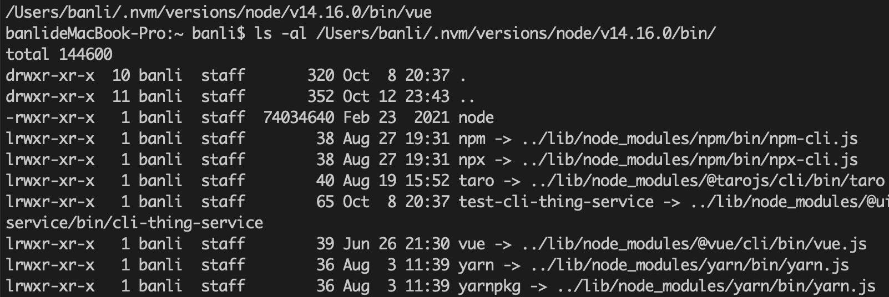
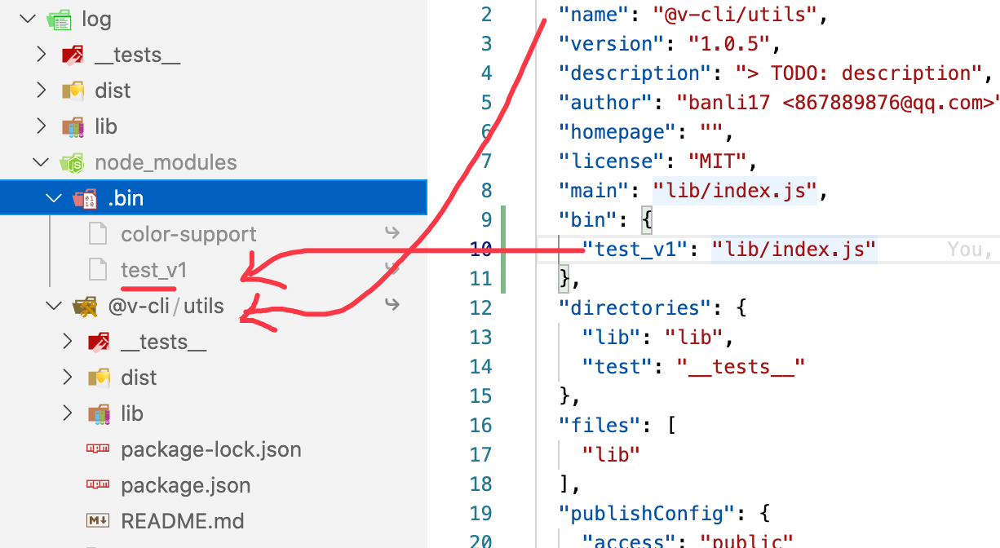
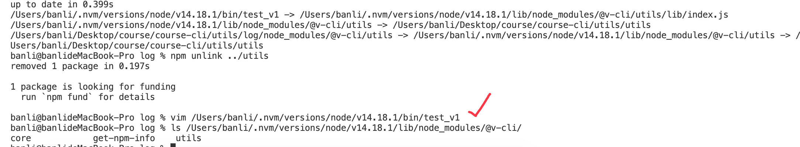

# 脚手架执行原理

## 脚手架是什么

脚手架本质是一个操作系统的客户端，通过命令行执行。实际上是因为 node 是一个客户端，编写的脚本文件通过 node 去执行。

比如执行 node 命令:

```
node vue.js
node -e "console.log('vue')"
```

使用 vue 脚手架执行命令:

```
vue create test --force
```

## 执行命令语句

一个执行命令语句分为:

- 主命令, 如 vue
- command 子命令, 如 create
- command 的 param 参数, 如 test
- option: 如选项名 `--force` 或短写 `-f`, 选项值为 true

## 命令执行流程

执行一个命令时, 会经历如下步骤: 

1. 终端在环境变量中找到命令，即 which vue。
2. vue 是个软链接, 指向全局安装的 node_modules 里的 vue。
3. 使用 node 执行 vue.js
4. 执行完毕，退出



## npm i -g 做了什么

在执行 `npm i -g @vue/cli` 时, 做了如下事情:

- 安装 `@vue/cli` 包
- 根据 package.json 里 bin 配置在 node/bin 下创建软链接 vue -> vue.js

注意：如果当前目录下有 @vue/cli 目录，会在全局 node_modules 下创建该目录的一个软链接指向本地当前目录，如果不想这样，就离开该目录进行全局安装

在执行 vue 命令时:

- 终端会在环境变量中找 vue 命令，然后找到真实的 vue.js 文件。
- vue.js 第一行内容是 `#!/usr/bin/env node`, 它告诉系统在执行文件时, 到环境变量 env 里去寻找 node 命令，然后执行，即 `node vue.js`。

注意: 不能写成本机 node 程序地址, 如`#!/usr/bin/node`，这样在其他人电脑上可能就不存在。

**软链接命令**

```
ln -s xx/vue.js /usr/bin/vue
```

本地调试脚手架

1. 在该目录的父级 npm i -g xx, 会创建该目录的软链接
2. 在该目录中, npm link 会创建 2 个软链接，一个 bin，一个 lib

脚手架分包本地调试

```
test-v-cli
test-v-lib
```

1. 首先在 test-v-lib 里 npm link 链接到全局
2. 在 test-v-cli package.json 里添加依赖 test-v-lib，然后 npm link test-v-lib, 会将全局的 test-v-lib 链接到本地 node_modules 下。

```
/Users/banli/Desktop/learn/engineering/cli/test-v-cli/node_modules/test-v-lib -> /Users/banli/.nvm/versions/node/v14.16.0/lib/node_modules/test-v-lib -> /Users/banli/Desktop/learn/engineering/cli/test-v-lib
```

也可以直接在 test-v-lib 里 npm link ../test-v-lib 包创建软链接。

```
/Users/banli/.nvm/versions/node/v14.16.0/lib/node_modules/test-v-lib -> /Users/banli/Desktop/learn/engineering/cli/test-v-lib
/Users/banli/Desktop/learn/engineering/cli/test-v-cli/node_modules/test-v-lib -> /Users/banli/.nvm/versions/node/v14.16.0/lib/node_modules/test-v-lib -> /Users/banli/Desktop/learn/engineering/cli/test-v-lib
```

npm link (directory)做了什么:

1. 在当前目录安装依赖
2. 将目标包 bin 命令软链接到全局 node 目录的 bin 目录下，再软链接到当前包的 `node_modules/.bin` 下
3. 将目标包软链接到 node 目录的 lib 目录下，再软链接到当前包的 `node_modules` 下



注意：上面如果传入参数 directory, 在 unlink 时, 全局的文件不会被删除。



unlink 的流程：

1. 在 test-v-cli 中 npm unlink test-v-lib
2. 在 test-v-lib 中 npm unlink, 然后发布
3. 在 test-v-cli 中安装远程的 test-v-lib，然后发布

如果报错可以直接删除 node_modules 下的 test-v-lib。


windows 下是会编译出三个文件

vue
vue.cmd
vue.ps1 powershell

会去执行 C:\Users\Admin\AppData\Roaming\npm 下的 node_modules\@vue\cli\bin\vue.js

```
# vue.cmd
@ECHO off
SETLOCAL
CALL :find_dp0

IF EXIST "%dp0%\node.exe" (
  SET "_prog=%dp0%\node.exe"
) ELSE (
  SET "_prog=node"
  SET PATHEXT=%PATHEXT:;.JS;=;%
)

"%_prog%"  "%dp0%\node_modules\@vue\cli\bin\vue.js" %*
ENDLOCAL
EXIT /b %errorlevel%
:find_dp0
SET dp0=%~dp0
EXIT /b

```


https://unix.stackexchange.com/questions/29608/why-is-it-better-to-use-usr-bin-env-name-instead-of-path-to-name-as-my

https://www.baeldung.com/linux/bash-shebang-lines#:~:text=As%20we%20mentioned%20earlier%2C%23!%2F,commands%20with%20the%20defined%20interpreter.