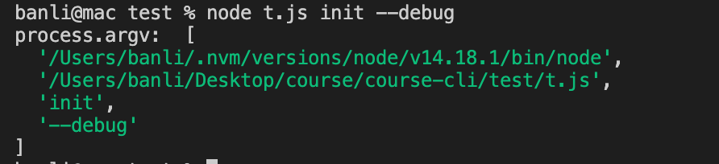
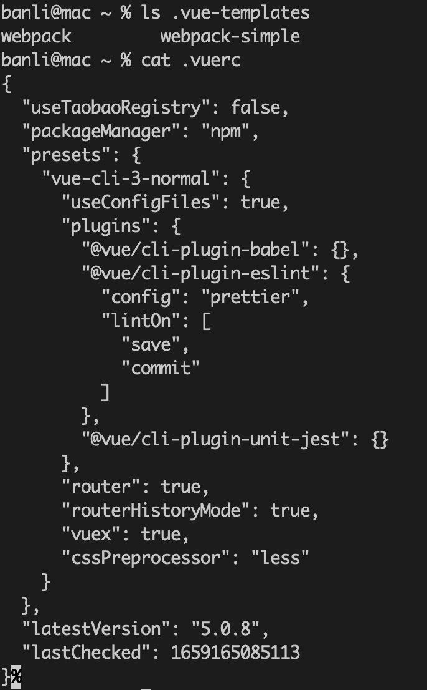

# 脚手架核心流程开发(一): 整体介绍

脚手架的核心流程包括三步:

- 准备阶段
- 命令注册
- 命令执行

## 内容

**涉及技术点**

核心库

- import-local
- Commander

工具库

- npmlog 打印日志
- fs-extra 文件操作
- semver 版本检查
- colors 打印彩色文字
- user-home 获取用户主目录
- dotenv 获取环境变量
- root-check root 检查和降级

## 准备阶段

在命令的准备阶段需要做的事情如下:

- import-local
- 打印命令包版本号
- Node 版本号检查
- Root 账户检查和自动降级
- 用户主目录检查
- 入参检查
- 环境变量检查

### 打印命令包版本号

主要用于打印客户端的版本信息。

```js
function printPkgVersion() {
  log.info("cli", pkg.version);
}
```

### Node 版本号检查

检查用户的 node 版本，并给出最低 node 兼容版本的提示。

```js
function checkNodeVersion() {
  const currentVersion = process.version;
  const allowVersion = pkg.engines.node;

  if (!semver.satisfies(currentVersion, allowVersion)) {
    log.error(`@v-cli 需要安装 v${allowVersion} 版本的 Node.js`);
    process.exit(1);
  }
}
```

### Root 账户检查和自动降级

尝试降级具有 root 权限的进程的权限，如果失败则阻止访问，这样可以阻止使用 root 执行脚本后续所带来的权限问题。


使用 [root-check](https://www.npmjs.com/package/root-check) 可以很简单完成这个工作。

> window 系统可以忽略

```js
import rootCheck from "root-check";

rootCheck();
```

**root-check 源码**

```js
"use strict";
var downgradeRoot = require("downgrade-root");
var sudoBlock = require("sudo-block");

module.exports = function () {
  try {
    downgradeRoot();
  } catch (err) {}

  sudoBlock.apply(null, arguments);
};
```

可以看到 root-check 是调用了两个包来实现的。

- [downgrade-root](https://www.npmjs.com/package/downgrade-root) 尝试降级具有 root 权限的进程的权限
- [sudo-block](https://github.com/sindresorhus/sudo-block) 用于阻止用户使用 sudo 权限执行命令

查看上面两个包的源码，可以学到一些知识点：

1、如何判断是 root 用户。可以通过 uid 是 0 来判断

```js
// npm package: is-root
function isRoot() {
  // root 的 uid 是 0
  return process.getuid && process.getuid() === 0;
}
```

2、非 root 用户的默认 uid。

```js
// npm package: default-uid
const DEFAULT_UIDS = {
  darwin: 501,
  freebsd: 1000,
  linux: 1000,
  sunos: 100,
};

export default function defaultUid(platform = process.platform) {
  return DEFAULT_UIDS[platform];
}
```

3、如何降级 root？通过 setuid() 将 root uid 降级为普通 uid。

```js
function downgradeRoot() {
  if (!isRoot()) {
    return;
  }

  //...

  if (process.setuid) {
    const uid = Number.parseInt(process.env.SUDO_UID, 10) || defaultUid();
    if (uid && uid > 0) {
      process.setuid(uid);
    }
  }
}
```


### 用户主目录检查

检查用户主目录的目的，是为了后续能将一些缓存文件放在该目录下。

通过 `os.homedir()` 可以获取到当前用户的主目录。

```js
import { homedir } from 'os'
function checkUserHome() {
  const dir = homedir()
  if (!dir && !pathExists(dir)) {
    throw new Error(`当前登录用户主目录不存在`);
  }
}
```

不同系统的用户主目录格式不同。

- linux 下，root 用户目录是 `/root`，普通用户目录是 `/home/用户名`
- macOS 下，用户目录是 `/Users/用户名`
- windows 下，用户目录是 `C:\Users\用户名`，可以通过 process.env.USERPROFILE 获得。

> 通过 os.userInfo().username 获取当前用户名

### 入参检查

在这一步主要是检查参数是否合法，不过由于后面会使用如 commander 或 cac 库来注册命令，它们都有参数检查的功能。

所以在这里，只进行 --debug 的检查，用于初始化 log 级别，是否打印调试信息。

参数的解析可以通过 `process.argv` 来获取。



`process.argv` 返回一个数组，第一项是 node 的路径，第二项是入口文件的路径，后面是所带的参数。

有很多用于解析参数的库，如 [minimist](https://www.npmjs.com/package/minimist)、[yargs-parser](https://www.npmjs.com/package/yargs-parser) 等。

**minimist**

```js
var argv = require('minimist')(process.argv.slice(2));
console.log(argv);
```

```sh
$ node t.js -x 3 -y 4 -n5 -abc --beep=boop foo bar baz
{ _: [ 'foo', 'bar', 'baz' ],
  x: 3,
  y: 4,
  n: 5,
  a: true,
  b: true,
  c: true,
  beep: 'boop' }
```

可以看到，它会返回一个对象，未识别的参数会放到 key 为 `_` 的数组里。如果要传递多个值，有两种传参方式。

```sh
$ node t.js  -a 1 -a 2 -a 3
{ _: [], a: [ 1, 2, 3 ] }

# 这里不能有空格
$ node t.js  -a={1,2,3}
{ _: [], a: [ 1, 2, 3 ] }
```

> minimist 不能像 `node t.js -a 1 2 3` 这样传参数，这点不太方便。

### 环境变量检查

一般来说，脚手架会在用户的主目录创建配置文件和目录，用来存放一些东西，比如 vue 创建的 .vuerc 和 .vue-templates 目录。



或者 npm 创建的 .npmrc 和 .npm 目录。


如果需要支持用户使用如 .env 文件来设置脚手架的配置项，可以使用 [dotenv](https://www.npmjs.com/package/dotenv) 库。

dotenv 库可以将 .env 文件中的配置项加载到 process.env 对象上。

比如下面 .env 文件内容：

```
NAME="zhangsan"
PASSWORD="12"
```

会被转换为:

```js
process.env.NAME // "zhangsan"
process.env.PASSWORD // "12"
```

下面是检查主目录的示例代码：

```js
import dotenv from "dotenv";

function checkEnv() {
  // 1. 检查用户主目录下的 .env 文件并解析
  const dotenvPath = path.resolve(userHome, ".env");
  if (pathExists(dotenvPath)) {
    dotenv.config({
      path: dotenvPath, // 默认值为 process.cwd() + '.env'，而不是用户主目录下的 .env，如果没有这个文件, 就会报错
    });
  }

  // 2. 创建默认配置
  if (process.env.CLI_HOME) {
    cliConfig.cliHome = path.join(userHome, process.env.CLI_HOME);
  } else {
    cliConfig.cliHome = path.join(DEFAULT_CLI_HOME);
  }
}
```

## 附

**node 能识别的文件**

- .js
- .json -> JSON.parse
- .node -> dlopen
- 其他文件后缀 -> 只会当作 .js 进行解析, 如果解析失败会报错，比如 readme 里写 js 代码, 是可以的。不会尝试当 json 解析

```js
const a = require("../a.txt");
console.log(a); // object {} 是 module.exports 对象
```
