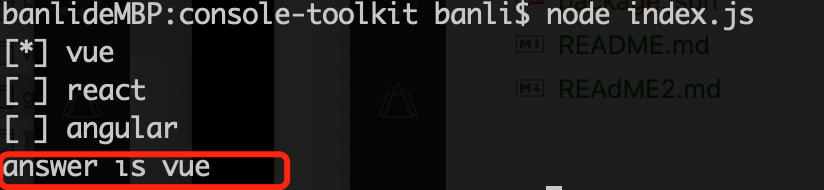
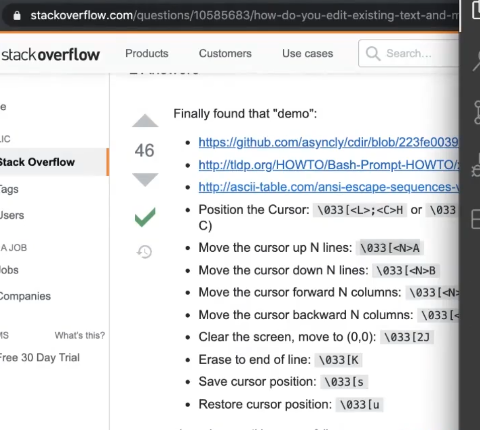
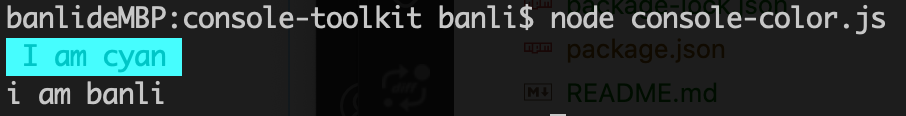
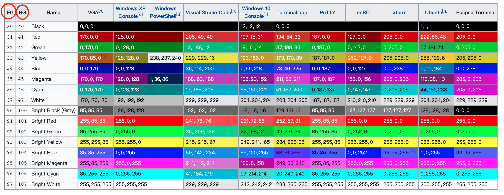
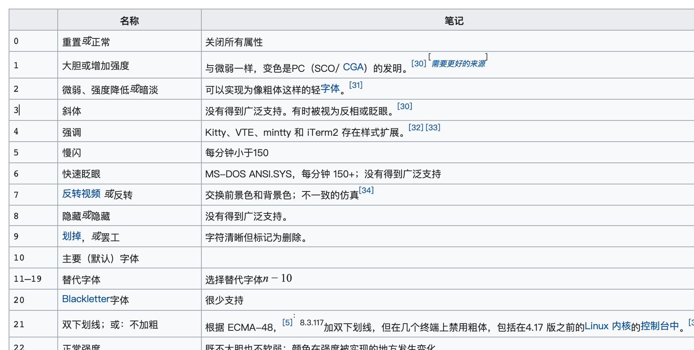
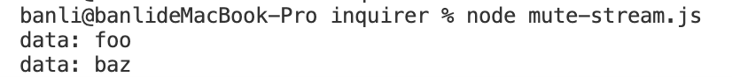

# 命令行交互原理

## 学习路径

- 掌握 readline/events/stream/ansi-escapes/rxjs/mute-stream
- 掌握命令行交互的实现原理，并实现一个可交互的列表
- 分析 inquirer 源码掌握其中的关键实现

## ansi 序列字符

ansi 序列字符(ANSI_escape)是一套用于命令行的字符规范，它定义的字符具有一些功能：

- 可以控制光标左右、上下移动等
- 可以让字加粗、斜体等
- 可以让字变色等 (只有特定的一些颜色)

- [更多：样式、颜色等控制](https://en.wikipedia.org/wiki/ANSI_escape_code#Colors)


### 控制光标移动

如何在打印出选项信息后，使用键盘上下键来移动光标，选择完成后输出选择信息？如下图。





### 打印带样式的文字

在 Node 中，可以下面命令在控制太打印带有颜色的文字：

```
console.log('\x1b[106m \x1b[36m%s \x1b[0m', 'I am cyan');
console.log('i am banli');
```



- `\x1b[36m` 表示设置终端前景色为青色
- `\x1b[106m` 表示设置终端背景色为亮青色
- `\x1b[0m` 表示重置终端颜色。

其中 `\x1b[` 叫做 CSI(控制序列介绍器)，它相当于一个函数。

如`\x1b[0;1;34m`，可以这样阅读：

```
\x1b[ # call a function
0;1;34 # function arguments (0, 1, 34)
m # function name
```

关于前/背景色的颜色值列表如下:



关于样式：



### ansi-escapes 包

<https://www.npmjs.com/package/ansi-escapes> 将 ansi-escapes 封装成了 API 操作。


```js
import ansiEscapes from 'ansi-escapes';

// 将光标向上移动两行，并左移一位
process.stdout.write(ansiEscapes.cursorUp(2) + ansiEscapes.cursorLeft);
//=> '\u001B[2A\u001B[1000D'
```

## mute-stream

mute-stream 是一个 `mute(静默)流` 包，它可以开启 mute 模式，在这个模式下，不会有内容进行输出。

```js
const MuteStream = require('mute-stream')

const ms = new MuteStream()
ms.pipe(process.stdout)

ms.write('foo') // 控制台打印 foo
ms.mute()
ms.write('bar') // 控制台不打印 bar
ms.unmute()
ms.write('baz') // 控制台打印 baz
```


**自定义接受数据**

```js
const ms = new MuteStream()
const input = process.stdin
input.pipe(ms)
ms.on('data', (c) => {
  console.log('data: ' + c)
})

input.emit('data', 'foo') // 控制台打印 foo
ms.mute()
input.emit('data', 'bar') // 控制台不打印 bar
ms.unmute()
input.emit('data', 'baz') // 控制台打印 baz
input.pause()
```



## rxjs


## 实现一个可交互列表

- [查看Demo](../__tests__/inquirer/list.js)
