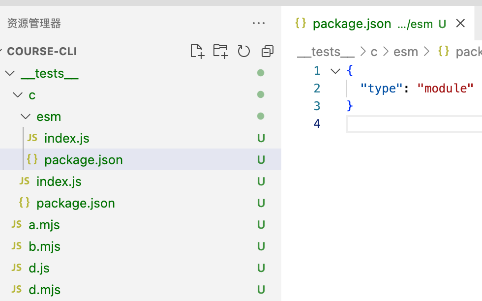

# Nodejs 使用 ESM

## Nodejs 中使用 ES6

### 方式一：使用 webpack 或 ts 等工具

```js
module.exports = {
  mode: "development",
  entry: dirPath,
  output: {
    filename: "index.js",
    path: path.resolve(__dirname, dir, "dist"),
    library: {
      // export: 'default',
      type: "commonjs", // 用于 require, 不写的话 require 是一个空对象
    },
  },
  target: "node",

  // context: __dirname,
  // node: {
  //  __filename: false,
  //  __dirname: false
  // },
  module: {
    rules: [
      {
        test: /\.js$/,
        exclude: /node_modules/,
        use: {
          loader: "babel-loader",
          options: {
            presets: ["@babel/preset-env"],
            plugins: [
              [
                "@babel/plugin-transform-runtime",
                {
                  corejs: 3, // 需要装 @babel/runtime-corejs3
                  regenerator: true,
                  useEsModules: true,
                  helpers: true,
                },
              ],
            ],
          },
        },
      },
    ],
  },
};
```

### 方式二：使用 mjs

脚本文件需要全部使用 `.mjs` 后缀。并且在 import 时需要加文件后缀。

```js
import b from './b.mjs'
```

### 方式三：使用 type module

可以在目录里的 package.json 中添加 `{type: 'module'}` 字段。这样 node 在解析目录文件时，会把文件当作 esModule 文件来解析。

> .mjs 文件总是以 ES6 模块加载，.cjs 文件总是以 CommonJS 模块加载，.js 文件的加载取决于package.json 里面 type 字段的设置。

- Nodejs v10 以上试验性支持 es6, 启动 node 命令时添加 `--experimental-module`
- Nodejs v12.20 以上自动支持 es6, 不过 node 命令运行时需要 `.mjs` 后缀, 如果是包里加了 `type:module` 则不需要加 `.mjs`

例如：

```sh
# node v10
node --experimental-module 1.mjs

# node v14
node 1.mjs
node 1.js # 如果 package.json 设置了 type: module
```

## ES6 模块加载 CommonJS 模块

es模块的 import 语句可以直接加载 node 第三方模块，但是只能整体加载，不能进行模块加载。

```js
// index.mjs 或 package.json 加 type module
import npmlog from 'npmlog' // 正确
import { warn } from "npmlog"; // 错误
```

这是因为 ES6 模块需要支持静态代码分析，而 CommonJS 模块的输出接口是module.exports，是一个对象，无法被静态分析，所以只能整体加载。

## 同时支持两种格式的模块

一个模块同时要支持 CommonJS 和 ES6 两种格式，也很容易。

**方法一**

- 对于 ES6 模块，需要给一个整体输出接口，如 `export default obj`，这样 CommonJS 可以用 `import()` 进行加载。
- 对于 CommonJS 模块，因为 ES6 模块可以直接加载 CommonJS 模块，所以可以用 ES6 模块进行包装，然后导出。

```js
// b.js
// commonjs 可以通过 import() 来加载 es module
import("./c").then((res) => {
  console.log(res); // [Module: null prototype] { default: { name: 'zhangsan', age: 12 } }
});
```

另外执行文件时，需要加上`--experimental-specifier-resolution=node`。

```sh
node --experimental-specifier-resolution=node b.js
```

**方法二**

在 package.json 中增加 exports 字段。exports 字段可以设置不同方式的引用入口文件。

```json
{
  "exports": {
    "require": "./index.js",
    "import": "./esm/wrapper.js"
  }
}
```

上面的 `./esm/wrapper.js` 文件所在的 esm 目录，也有一个 package.json 文件，指定了 type 为 module。

**注意要将包放在 node_modules 下进行测试**。目录结构如下：



```
// d.mjs
import c from "c";
console.log(c);
```

可以参考 <https://github.com/softonic/axios-retry/blob/master/package.json> 的 exports 写法。

**方法三**

nodejs 里使用 esm，还可使用 createRequire 方式，它是同步的。

```js
import {createRequire} from 'module'
const require = createRequire(import.meta.url)

const config = require('./config.js')
console.log(config)
```
