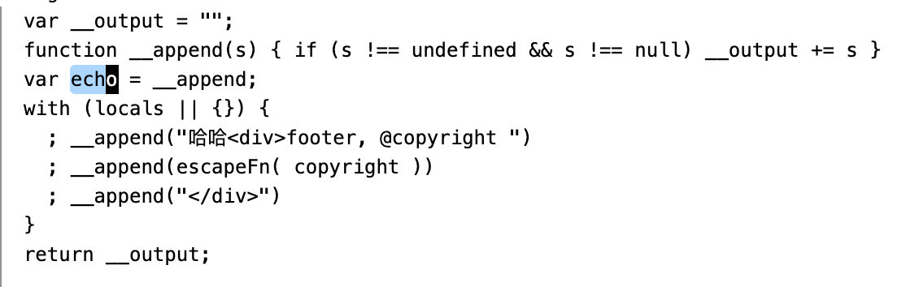

# ejs

## ejs 三种用法

- ejs.compile()
- ejs.render()
- ejs.renderFile()

## 标签含义

```
<%   脚本 ，用于流程控制，无输出
<%_  删除其前面的空格
<%=  输出转义的数据到模版
<%-  输出非转义的数据到模版
<%#  注释标签，不执行，不输出内容
<%%  输出字符串 '<%'
%%>  输出字符串 '%>'
-%>  删除其后面的换行符
_%>   将结束标签后面的空行符删除
```

## 选项



## 包含

```
<%- include('./footer.html'), { copyright } -%>

// 这里的 copyright 可以不传递, footer 也会共享传入的 data 数据
```

## 分隔符

单个文件模版

```js
ejs.render(html, data, {
  delimiter: '?'
})
```

全局

```
ejs.delimiter = '$'
```

## 自定义文件加载器

```js
let myFileLoader = (filePath) => {
  return '<div style="color: red">版权申明</div>' + fs.readFileSync(filePath)
}
ejs.fileLoader = myFileLoader
```


## 缓存

```js
let ejs = require('ejs'),
LRU = require('lru-cache');
ejs.cache = LRU(100); // LRU cache with 100-item limit
```

可以使用 ejs.clearCache() 清空缓存。

