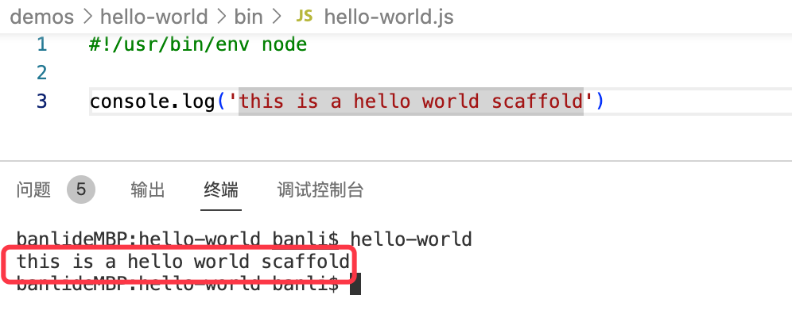
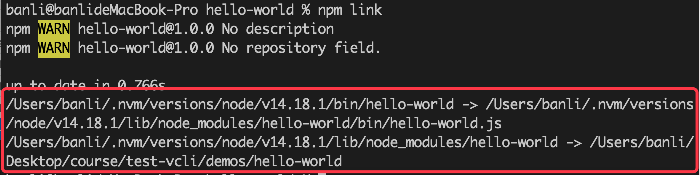
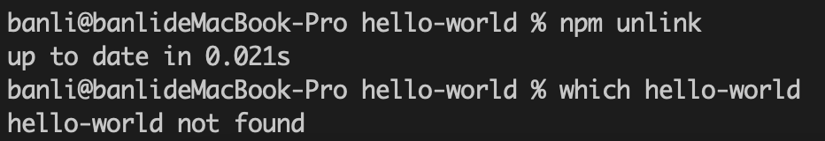
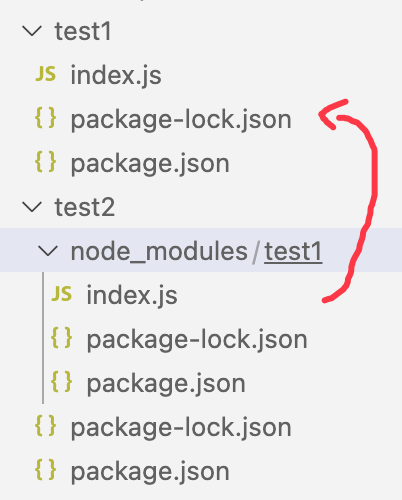
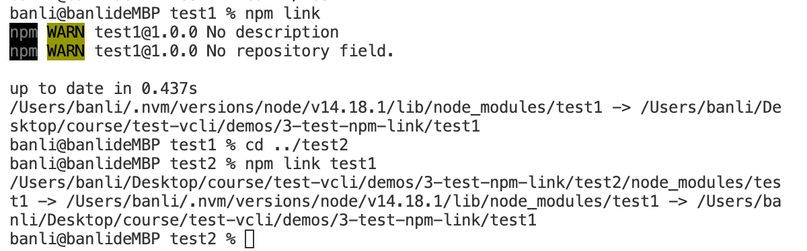
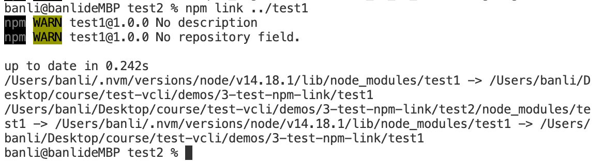

# 快速上手

上文知道了 vue 命令的运行过程，这篇文章将按照此模式，快速创建一个 `hello-world` 脚手架, 来感受一下脚手架的开发过程。

## 执行步骤

1、创建一个 hello-world 目录，使用 `npm init -y` 进行初始化。

2、在根目录创建 bin 目录，然后创建 hello-world.js，写入如下代码:

```js
#!/usr/bin/env node

console.log('this is a hello world scaffold')
```

3、在 package.json 里配置 `bin` 字段，指向 bin/hello-world.js 文件。

4、进入 hello-world 目录，执行 `npm link` 命令，这样就可以本地调试命令了。

5、在命令行，敲 `hello-world` 回车，可以看到打印的内容。



6、使用 `npm publish` 发布。

7、其它人就可以通过 `npm i -g hello-world` 进行安装，然后执行命令了。

> 这里 npm 包名 `hello-world` 仅为举例，如有冲突，需要自己修改报名。

上面步骤中，第 4 步是比较关键的，为什么我们执行 `npm link` 命令后，就可以在命令行运行 `hello-world` 命令了呢？

## npm link 做了什么

`npm link`命令做了下面几件事情:

1、在当前目录安装依赖包。
2、将目标包 bin 命令软链接到全局 node 目录的 bin 目录下，再软链接到当前包的 `node_modules/.bin` 下。
3、将目标包软链接到 node 目录的 lib 目录下，再软链接到当前包的 node_modules 下。



可以通过 `npm unlink` 删除上面的软链接。



> 如果执行的是 `npm link (directory)`，传入参数 directory, 在 unlink 时, 链接内容不会被删除。
> 如果 unlink 有报错，可以直接手动去删除 node_modules 下的文件。

**更多**

npm link 命令还可以接受一个参数，本地包目录或者包名。

```sh
npm link (in package dir)
npm link [<@scope>/]<pkg>[@<version>]
```

它可以让我们调试本地包，比如包 test2 里需要使用依赖包 test1。

```
- test1
- test2
	- dependencies: test1
```

1、首先在 test1 里执行 `npm link`，它会链接到全局去。
2、然后在 test2 的 package.json 里添加依赖 test1，然后 `npm link test1`, 会将全局的 `test1` 链接到本地 node_modules 下。
3、这样，就可以在 test2 里使用 test1 了，而且它是软链接，意味着 test1 内容修改后, test2 中引用的 test1 也会变化。






上面的 3 步 ，其实也可以简化成直接在 test2 里 `npm link ../test1` 创建软链接，它的执行过程也是先将 test1 添加到全局，然后再将 test2 里的依赖 test1 指向全局。


